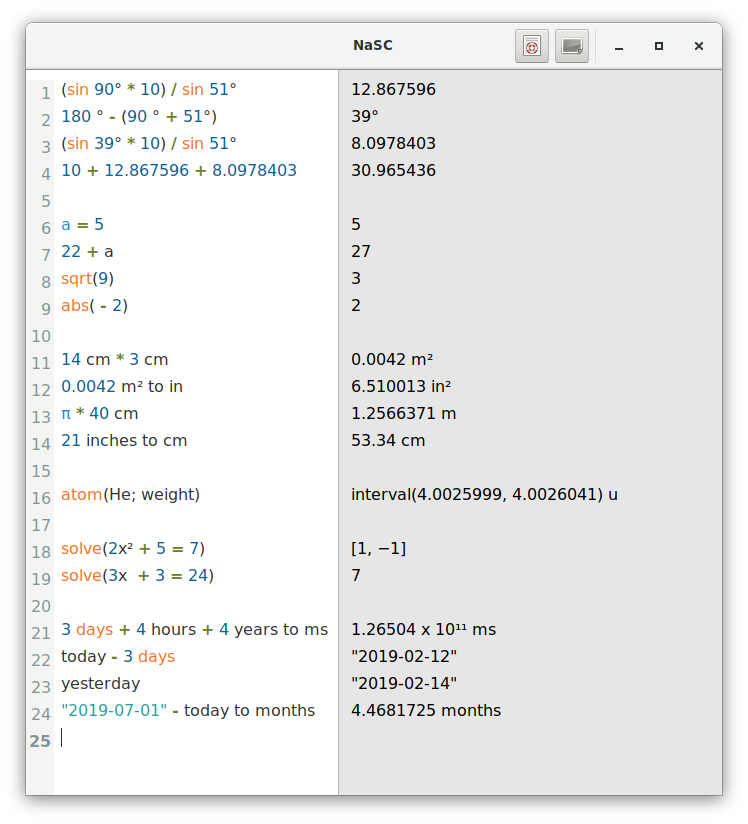

# nasc-flatpak

**NaSC** is an app where you do maths like a normal person. It lets you type whatever you want and smartly figures out what is math and spits out an answer on the right pane. Then you can plug those answers in to future equations and if that answer changes, so does the equations it's used in.



[Homepage](http://parnold-x.github.io/nasc)

This repo is about the flatpak package.

## Instructions

### Requirements

* [flatpak](https://github.com/flatpak/flatpak)
* [flatpak-builder](https://github.com/flatpak/flatpak-builder)

For EL7:

```
# yum install 'flatpak' 'flatpak-builder'
```

You may also wish to install the `xdg-desktop-portal*` packages:

```
# yum install 'xdg-desktop-portal*'
```

See also:

* [flatpak setup](https://flatpak.org/setup)

### Adding repository

```
$ flatpak remote-add --if-not-exists "flathub" "https://dl.flathub.org/repo/flathub.flatpakrepo"
```

See also:

* [flathub setup](http://docs.flatpak.org/en/latest/using-flatpak.html#add-a-remote)

### Prepare

```
$ flatpak install "flathub" "org.gnome.Sdk//3.30"
```

```
$ flatpak install "flathub" "org.gnome.Platform//3.30"
```

```
$ flatpak install "flathub" "io.elementary.BaseApp//juno"
```

### Build

```
$ flatpak-builder "build" "com.github.parnold_x.nasc.yaml" --force-clean --install-deps-from="flathub"
```

### Test

```
$ flatpak-builder --run "build" "com.github.parnold_x.nasc.yaml" "sh"
```

### Test run

```
$ flatpak-builder --run "build" "com.github.parnold_x.nasc.yaml" "nasc"
```

### Install

```
$ flatpak-builder --repo="repo" --force-clean "build" "com.github.parnold_x.nasc.yaml"
```

```
$ flatpak --user remote-add --no-gpg-verify "nasc" "repo"
```

```
$ flatpak --user install "nasc" "com.github.parnold_x.nasc"
```

### Run

```
$ flatpak run "com.github.parnold_x.nasc"
```

### Uninstall

```
$ flatpak --user uninstall "com.github.parnold_x.nasc"
```

```
$ flatpak --user remote-delete "nasc"
```

See also: [Building your first Flatpak](http://docs.flatpak.org/en/latest/first-build.html)

## FAQ

### Why not a RPM package?

I already provided [COPR repo](https://copr.fedorainfracloud.org/coprs/scx/nasc) with (S)RPM packages for EL and Fedora.

### Are you the author of NaSC?

No, I only created the flatpak package for it.

See also:

* [GitHub repo](https://github.com/parnold-x/nasc)

