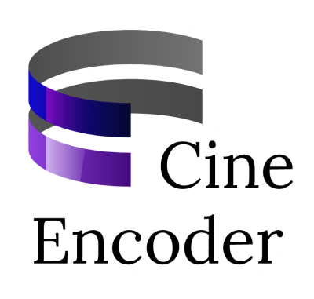
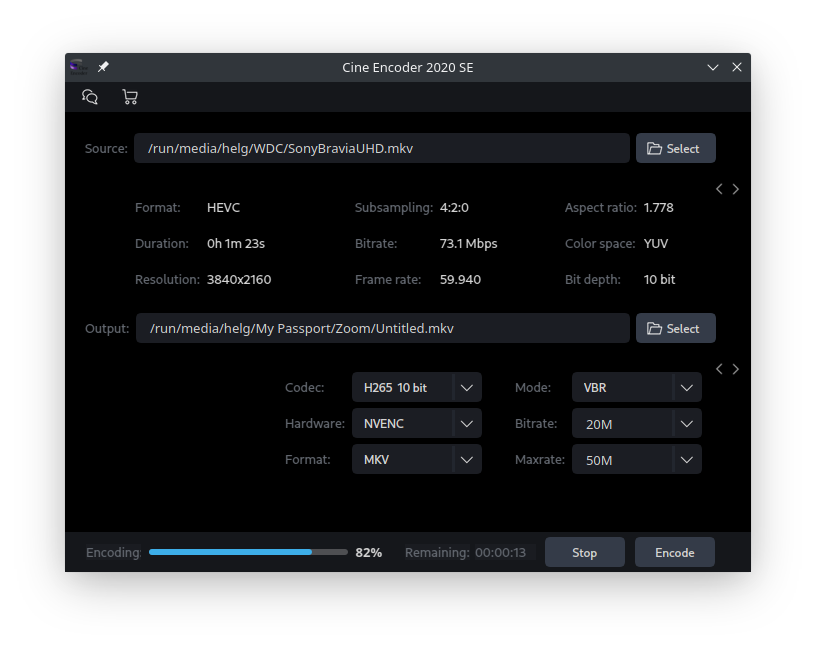
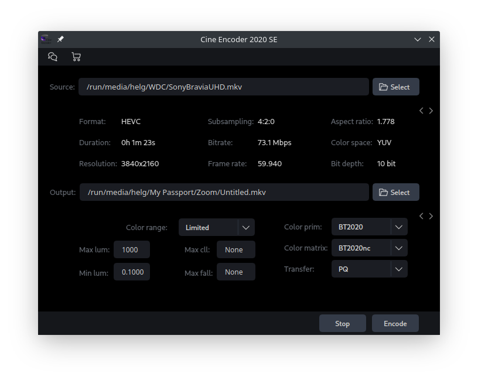

Cine Encoder for Linux is an application that allows you to convert media files while preserving HDR signals. NVENC hardware encoding for NVIDIA video cards is also supported for H265 and H264 modes. The following encoding modes are implemented:

  - H265 NVENC (8, 10 bit)
  - H265 (8, 10 bit)
  - H264 NVENC (8 bit)
  - H264 (8 bit)
  - VP9 (10 bit)
  - DNxHR HQX 4:2:2 (10 bit)
  - ProRes HQ 4:2:2 (10 bit)

# Review

# Licence

GNU GPL v.3
See [LICENSE.md](https://github.com/CineEncoder/CineEncoder/blob/master/LICENSE)

