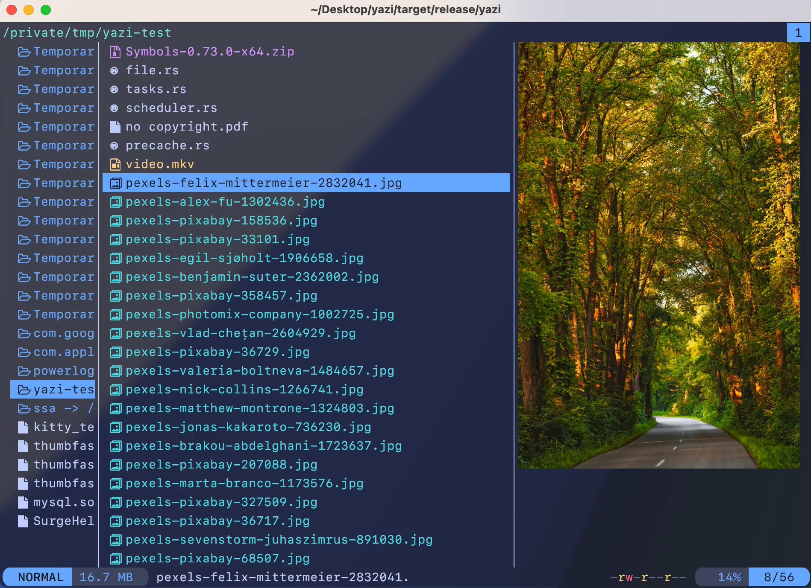

# iCloud Mail

An unofficial desktop application for iCloud Mail built with Electron. This application provides a native desktop experience for accessing Apple's iCloud Mail service on Linux.



## Features

- Native desktop application for iCloud Mail
- Context menu with common actions (Copy, Cut, Paste, Undo, Redo)
- Zoom controls (Zoom In, Zoom Out, Reset)
- External links open in default browser
- Full screen mode support
- Auto-hide menu bar for clean interface
- Desktop notifications support
- Optimized for Linux (X11 and Wayland)

## Installation

### Flatpak (Recommended)

Download the appropriate Flatpak package for your architecture from the [releases page](https://github.com/bdim404/icloud-mail/releases):

**For x86_64 systems:**
```bash
flatpak install --user iCloudMail-x86_64.flatpak
```

**For ARM64 systems:**
```bash
flatpak install --user iCloudMail-aarch64.flatpak
```

## Usage

### Running from Flatpak
```bash
flatpak run moe.bdim.iCloudMail
```

## Technical Details

- **Runtime:** Electron 30
- **Base App:** org.electronjs.Electron2.BaseApp
- **Platform:** org.freedesktop.Platform 23.08
- **App ID:** moe.bdim.iCloudMail

## Contributing

Contributions are welcome! Please feel free to submit issues and pull requests.

## License

This project is licensed under the MIT License - see the [LICENSE](LICENSE) file for details.

## Disclaimer

This is an unofficial application and is not affiliated with, endorsed by, or associated with Apple Inc. iCloud and iCloud Mail are trademarks of Apple Inc.
