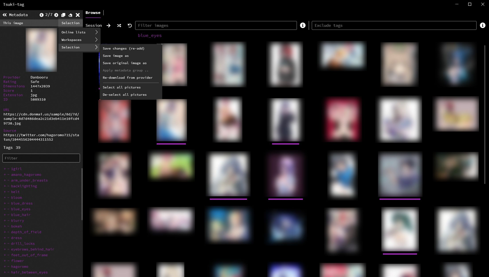

# Tsuki-tag

Tsuki-tag is an aggregated imageboard browser and collection manager, which lets you browse multiple image sources in a combined view, search images using tags, download images into configured workspaces (folders) with customization and filename templating support, and manage or curate multiple collections of your images. Tsuki-tag can inject EXIF metadata information (tag, image attributes, copyright notice, etc.) into the images during downloading or saving, with an additional option to convert non-JPG images to JPG images which support EXIF metadata. This could provide artists with a great way of creating and organizing a collection of images for reference, or to manage and appropriately annotate their own images with author and copyright information.

# Features

- Browse an aggregated collection of images retrieved from a number of pre-configured image providers in a paginated view.
- Fine-tune which providers are queried, along with what type of images should be shown ('safe', 'questionable', 'explicit').
- Search for images using tags and tag combinations with wildcard support, exclude images from being displayed using another set of tags with wildcard and regular expression support.
- Hover over images for a quick look at their attributes and information, or select them to keep them available for batch operations.
- Open images in separate tabs and continue browsing.
- Multi-selection system with support for batch operations (batch add to / remove from workspaces and online lists, batch update or annotate).
- Create online lists, which are a local collection of image metadata which can be browsed just as the online providers.
- Create workspaces, which on top of the features of online lists, lets you download images to configured folders with customizable behavior.
- Import local files or folders to workspaces, or convert one of your image folders to a workspace.
- Create metadata groups, which are a collection of information such as author, copyright notice, description and notes, which can be directly injected into the EXIF metadata of the JPG images files during workspace operations.
- Convert non-JPG images to JPG for EXIF support.
- Add, edit, or remove image tags before workspace or online list operations.
- Create tag rules for your online lists or workspaces with wildcard and regular expression support, to automatically process an image across multiple lists.
- Automatically add or remove tags when an image is added to, or removed from a workspace or online list, with templating support.  
- Specify the file names of files to be downloaded to a workspace, with templating support. 
- Global tag blacklisting with wildcard and regular expression support.
- Several other features such as opening images in your default image editor, opening or copying the image website URL, re-downloading the image from the original provider, and more.

# Screenshots

# License

GNU GPL v3

# Donate

[Ko-fi](https://ko-fi.com/ngelsi)