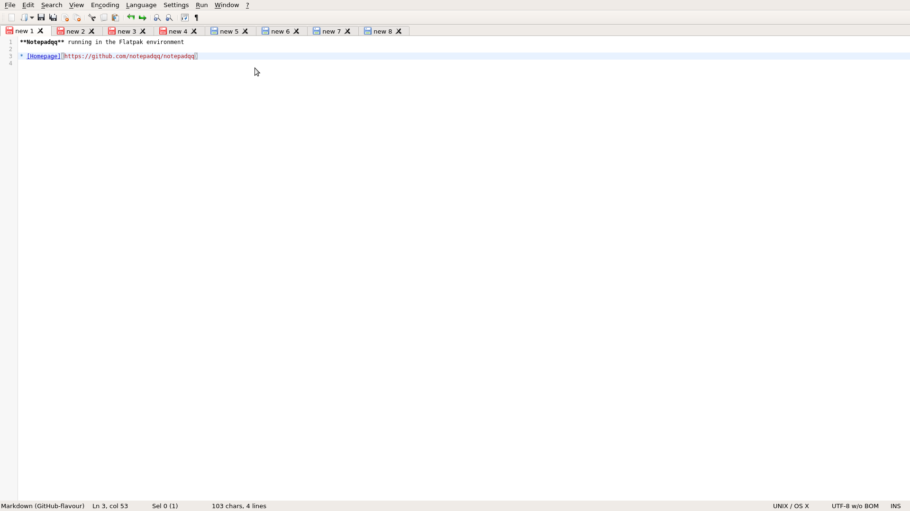

# notepadqq-flatpak

Notepadqq is a text editor designed by developers, for developers.



[Homepage](https://github.com/notepadqq/notepadqq)

This repo is about flatpak package.

## instructions

### Requirements

* [flatpak](https://github.com/flatpak/flatpak)
* [flatpak-builder](https://github.com/flatpak/flatpak-builder)
* [strip-json-comments](https://github.com/sindresorhus/strip-json-comments)

For EL7:

```
# yum install 'flatpak' 'flatpak-builder' 'nodejs-strip-json-comments'
```

You may also wish to install the `xdg-desktop-portal*` packages:

```
# yum install 'xdg-desktop-portal*'
```

See also:

* [flatpak setup](https://flatpak.org/setup)

### Adding repository

```
$ flatpak remote-add --if-not-exists flathub https://dl.flathub.org/repo/flathub.flatpakrepo
```

See also:

* [flathub setup](http://docs.flatpak.org/en/latest/using-flatpak.html#add-a-remote)

### Prepare

```
$ flatpak install flathub org.kde.Sdk//5.9
```

```
$ flatpak install flathub io.qt.qtwebkit.BaseApp
```

### Build

```
$ ./flatpak_create.bash
```

or just:

```
$ ./flatpak_build.bash
```

### Test

```
$ ./flatpak_shell.bash
```

### Run

```
$ ./flatpak_run.bash
```

## FAQ

### Which JSON file I should use?

* input file: `notepadqq.json.in` (with comments)
* output file: `com.notepadqq.Notepadqq.json` (without comments)

Comments are not allowed in JSON files.

### Does flatpak-ed Notepadqq run as superuser?

[No](https://github.com/flatpak/flatpak/issues/1557). It is a [MATE](https://github.com/mate-desktop)/[marco](https://github.com/mate-desktop/marco) [issue](https://github.com/mate-desktop/marco/issues/301).

### Why not use an RPM package?

I already provided a [repo](https://copr.fedorainfracloud.org/coprs/scx/notepadqq/) with RPM packages.

### Why I can't open any file?

Try:

1. install the latest version of `flatpak`
2. install the `xdg-desktop-portal*` packages
3. install the *com.notepadqq.Notepadqq* as a [flatpak package](http://docs.flatpak.org/en/latest/first-build.html#install-the-app)
4. set the [XDG_RUNTIME_DIR](https://github.com/flatpak/flatpak/issues/534#issuecomment-378824515) environment variable: `XDG_RUNTIME_DIR="/run/user/${UID}"`

### Are you the author of Notepadqq?

No, I only created the flatpak package for it.

See also:

* [Notepadqq readme](https://github.com/notepadqq/notepadqq/blob/master/README.md)

