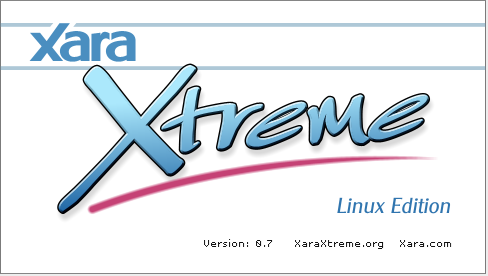

# xaralx-flatpak

**XaraLX** (AKA *Xara Xtreme for Linux*) is a powerful, general purpose vector graphics program.



[Homepage](http://www.xaraxtreme.org)

This repo is about flatpak package.

## Instructions

### Requirements

* [flatpak](https://github.com/flatpak/flatpak)
* [flatpak-builder](https://github.com/flatpak/flatpak-builder)
* [strip-json-comments](https://github.com/sindresorhus/strip-json-comments)

For EL7:

```
# yum install 'flatpak' 'flatpak-builder' 'nodejs-strip-json-comments'
```

You may also wish to install the `xdg-desktop-portal*` packages:

```
# yum install 'xdg-desktop-portal*'
```

See also:

* [flatpak setup](https://flatpak.org/setup)

### Adding repository

```
$ flatpak remote-add --if-not-exists flathub https://dl.flathub.org/repo/flathub.flatpakrepo
```

See also:

* [flathub setup](http://docs.flatpak.org/en/latest/using-flatpak.html#add-a-remote)

### Prepare

```
$ flatpak install flathub org.gnome.Sdk//3.28
```

```
$ flatpak install flathub org.gnome.Platform//3.28
```

### Build

```
$ ./flatpak_create.bash
```

or just:

```
$ ./flatpak_build.bash
```

### Test

```
$ ./flatpak_shell.bash
```

### Run

```
$ ./flatpak_run.bash
```

## FAQ

### Which JSON file I should use?

* input file: `xaralx.json.in` (with comments)
* output file: `org.xaraxtreme.XaraLX.json` (without comments)

Comments are not allowed in JSON files.

### It is so huge (flatpak manifest, of course)!

Yeah, just like my ego! :smirk:

But honestly, the development of this program stopped in 2007. It is not easy to maintain a package for such old software without a lot of patches and hooks. However, it is still a great app, and in some aspects, superior to [Inkscape](https://inkscape.org/en).

### Does flatpak-ed XaraLX run as superuser?

[No](https://github.com/flatpak/flatpak/issues/1557). It is a [MATE](https://github.com/mate-desktop)/[marco](https://github.com/mate-desktop/marco) [issue](https://github.com/mate-desktop/marco/issues/301).

### Why not use an RPM package?

I already provided a (S)RPM package for EL and Fedora.

### Are you the author of XaraLX?

No, I only created the flatpak package for it.

See also:

* [XaraLX FAQ](http://www.xaraxtreme.org/faqs.html)

