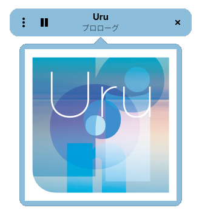

# The world's cutest radio


[](https://github.com/noobping/listenmoe/actions/workflows/win.yml)
[](https://github.com/noobping/listenmoe/actions/workflows/linux.yml)

**This is a Unofficial App for LISTEN.moe. Stream and metadata provided by [LISTEN.moe](https://listen.moe).**

The world's cutest radio. Dive into pure kawaii energy with nonstop Japanese and Korean hits, streamed straight from [LISTEN.moe](https://listen.moe/).

`

## Translations

The `po` folder contains translation files in `.po` (Portable Object) format. Other translations (such as the app description) are located in the [metainfo file](data/io.github.noobping.listenmoe.metainfo.xml). If you spot a typo, unclear wording, or have a better translation, contributions are welcome.

## Build

Build the flatpak App:

```sh
flatpak-builder --user --install --force-clean flatpak-build io.github.noobping.listenmoe.yml
```

Or build a AppImage:

```sh
./po.sh
appimage-builder --recipe .appimage-builder.yml
```

## Run (debug)

```sh
cargo run
```
