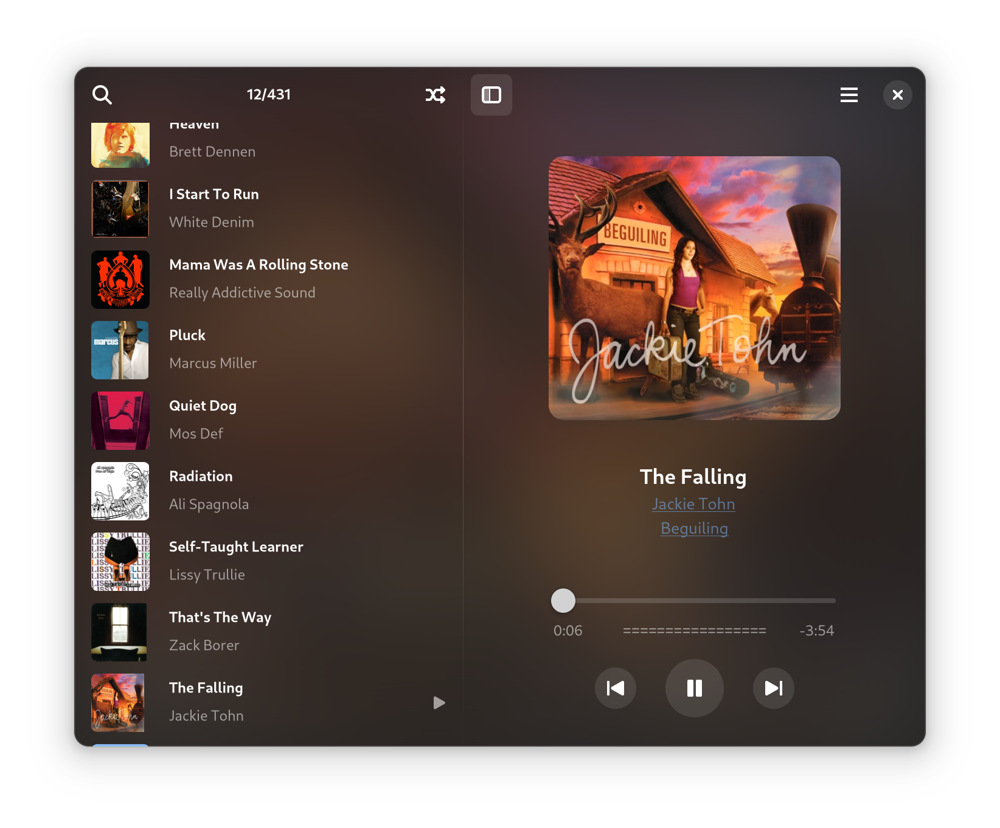

# G4Music

A fast, flurent, light weight music player written in GTK4, with a beautiful, modern user interface, so named G4Music.

## Features
- Supports most music file types,  samba or any other GIO supported remote protocols.
- Fast loading music files and parsing tags.
- Low memory / storage costs, no thumbnail caches.
- Gaussian blurred album cover as window background, follow GNOME 42 light/dark mode.
- Album cover with original resolution, can be exported.
- Flurent transition animations when switching songs and toogling play/pause.
- Supports full-text searching.
- Supports drag-drop from file manager.
- Supports pipewire audio sink.
- Show dynamic audio peak when playing.

## How to install 
It is written in Vala, simple and clean code, with few third-party dependencies:

1. Clone the code from gitlab.

2. Install gtk4, libadwaita, gstreamer develop packages.

3. Run in the project directory: `meson setup build & meson install -C build`

4. Flatpak packages will come soon...

## About this project
I was inspired by [Amberol](https://gitlab.gnome.org/World/amberol) when I started to learn program with GTK4, I found it is so convenient to write code in Vala language: handle signal with closure, async tasks, easy to compile with C code, similar with programming in Kotlin on Android.
