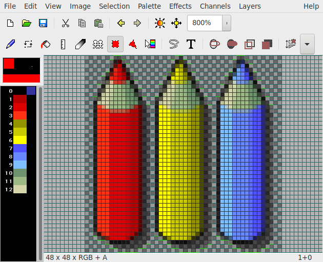

# mtpaint-flatpak

**mtPaint** is a simple painting program designed for creating icons and pixel-based artwork.



[Homepage](http://mtpaint.sourceforge.net)

This repo is about the flatpak package.

## Instructions

### Requirements

* [flatpak](https://github.com/flatpak/flatpak)
* [flatpak-builder](https://github.com/flatpak/flatpak-builder)

For EL7:

```
# yum install 'flatpak' 'flatpak-builder'
```

You may also wish to install the `xdg-desktop-portal*` packages:

```
# yum install 'xdg-desktop-portal*'
```

See also:

* [flatpak setup](https://flatpak.org/setup)

### Adding repository

```
$ flatpak remote-add --if-not-exists "flathub" "https://dl.flathub.org/repo/flathub.flatpakrepo"
```

See also:

* [flathub setup](http://docs.flatpak.org/en/latest/using-flatpak.html#add-a-remote)

### Prepare

```
$ flatpak install "flathub" "org.gnome.Sdk//3.30"
```

```
$ flatpak install "flathub" "org.gnome.Platform//3.30"
```

```
$ git submodule init
```

```
$ git submodule update
```

### Build

```
$ mkdir -p "build" && flatpak-builder "build" "com.github.wjaguar.mtpaint.yaml" --force-clean --install-deps-from="flathub"
```

### Test

```
$ flatpak-builder --run "build" "com.github.wjaguar.mtpaint.yaml" "sh"
```

### Test run

```
$ flatpak-builder --run "build" "com.github.wjaguar.mtpaint.yaml" "mtpaint"
```

### Install

```
$ flatpak-builder --repo="repo" --force-clean "build" "com.github.wjaguar.mtpaint.yaml"
```

```
$ flatpak --user remote-add --no-gpg-verify "mtpaint" "repo"
```

```
$ flatpak --user install "mtpaint" "com.github.wjaguar.mtpaint"
```

### Run

```
$ flatpak run "com.github.wjaguar.mtpaint"
```

### Uninstall

```
$ flatpak --user uninstall "com.github.wjaguar.mtpaint"
```

```
$ flatpak --user remote-delete "mtpaint"
```

See also: [Building your first Flatpak](http://docs.flatpak.org/en/latest/first-build.html)

## FAQ

### Does flatpak-ed mtPaint run as superuser?

[No](https://github.com/flatpak/flatpak/issues/1557). It is a [MATE](https://github.com/mate-desktop)/[marco](https://github.com/mate-desktop/marco) [issue](https://github.com/mate-desktop/marco/issues/301).

### Why not use an RPM package?

There are already [packages](https://pkgs.org/download/mtpaint) for various distributions.

### Are you the author of mtPaint?

No, I only created the flatpak package for it.

See also:

* [GitHub repo](https://github.com/wjaguar/mtPaint)

