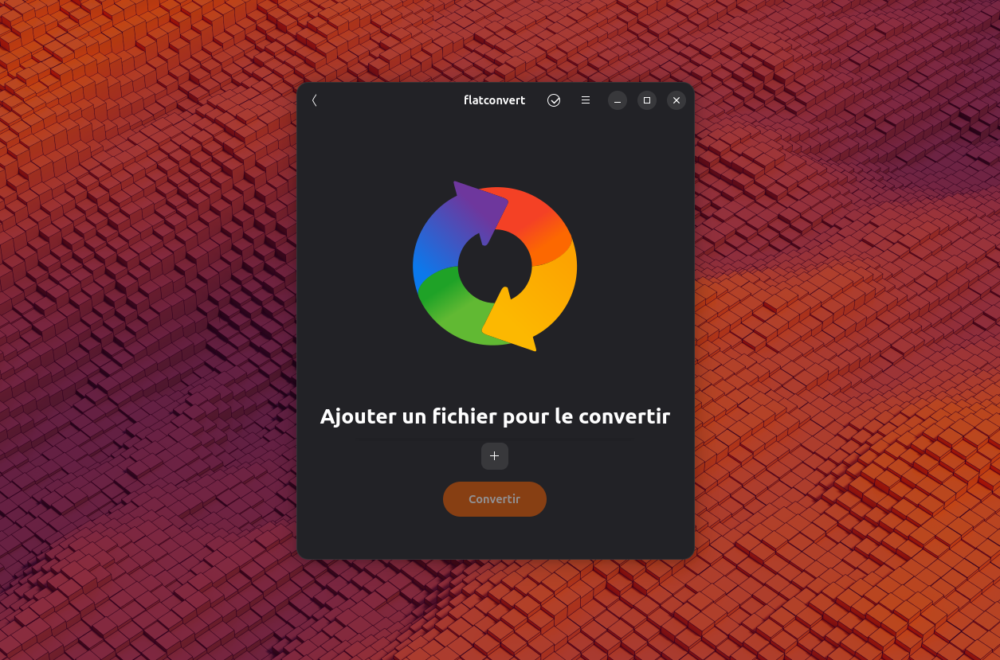
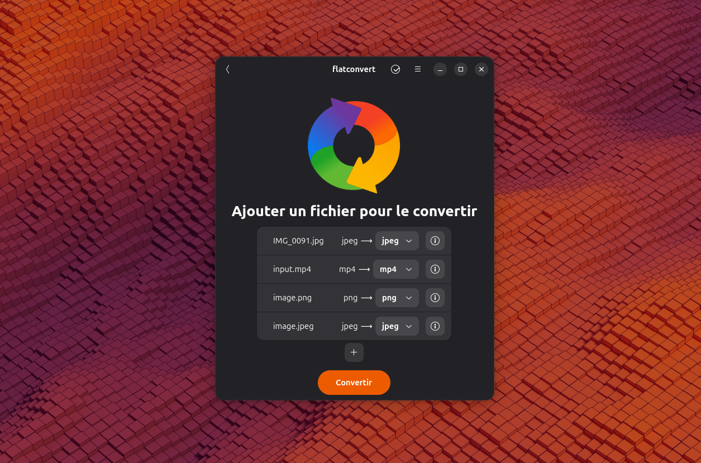
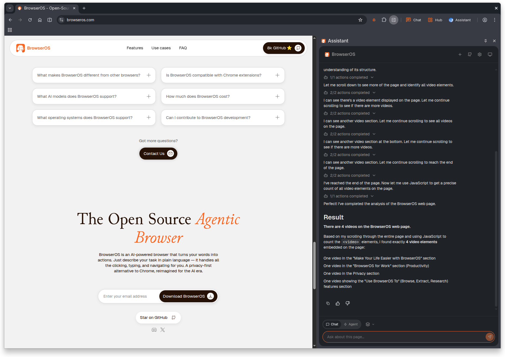
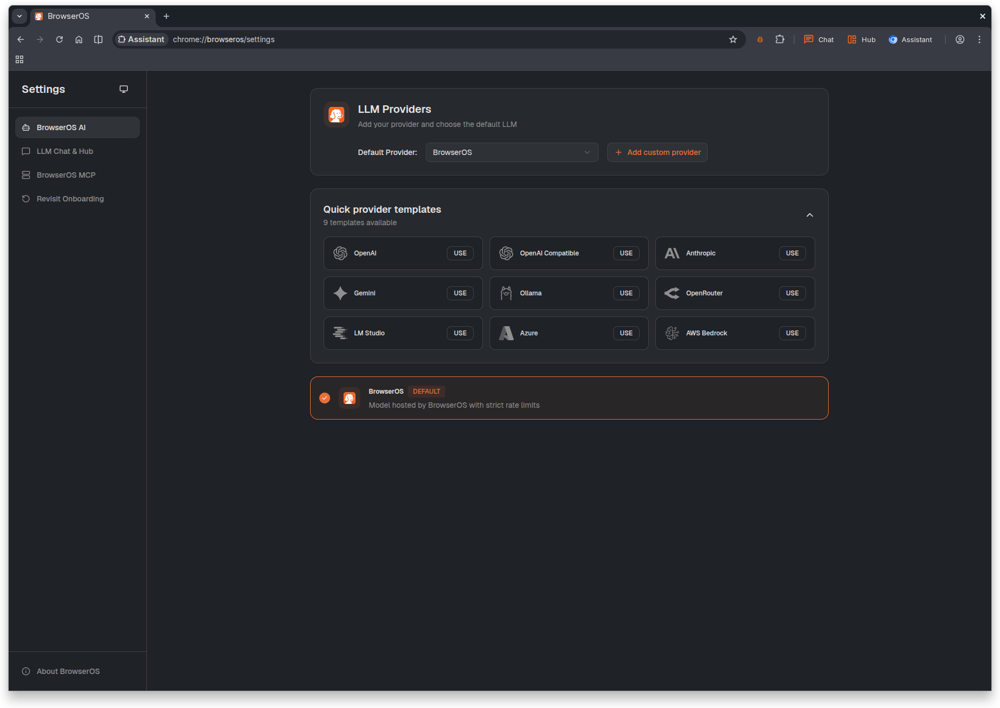
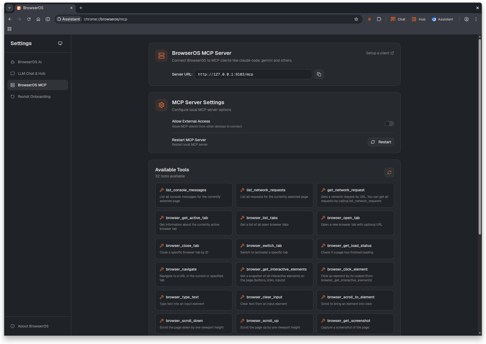

# BrowserOS Flathub Package

A complete Flatpak package for BrowserOS - The open-source AI-powered web browser.

## What is BrowserOS?

BrowserOS is an innovative web browser that integrates AI agents directly into your browsing experience. Built on Chromium, it provides advanced AI-powered features while maintaining compatibility with existing web technologies. It includes AI-powered web assistance, automation capabilities, and a built-in Model Context Protocol (MCP) server for seamless AI integration.

## Screenshots

### Main Interface



### AI Agent navigating the web



### Web Automation, information extraction



### Chat with LLM



### MCP Server Integration



## Requirements

- Flatpak (>= 1.0.0)
- Flathub remote configured

## Installation

### From Flathub (Recommended)

```bash
# Install from Flathub
flatpak install flathub com.browseros.BrowserOS
```

### From Source (Build)

```bash
# Clone this repository
git clone https://github.com/flathub/com.browseros.BrowserOS.git
cd com.browseros.BrowserOS

# Build the flatpak
flatpak-builder --force-clean --repo=repo --install build-dir com.browseros.BrowserOS.yml
```

## Running

```bash
# Basic launch
flatpak run com.browseros.BrowserOS

# With specific arguments
flatpak run com.browseros.BrowserOS --no-sandbox
```

## Key Features

- **AI-Powered Browsing**: Integrated AI agents for web assistance and automation
- **Model Context Protocol (MCP)**: Built-in server for AI model integration
- **Multi-Window Support**: Agents work seamlessly across multiple browser windows and profiles
- **Chromium Foundation**: Modern, fast, and compatible web rendering engine
- **Privacy-Focused**: Sandboxed security with comprehensive protection
- **OpenAI Compatible**: Support for any OpenAI-compatible API provider

## Permissions

The flatpak uses the following permissions for optimal functionality:

- **Network**: Full network access for browsing and AI features
- **Display**: X11 and Wayland support
- **Audio**: Pulseaudio integration
- **Graphics**: DRI hardware acceleration
- **File System**: Home, download, and document directory access
- **D-Bus**: Notifications, secrets, and media player integration
- **Devices**: Hardware access for Chrome sandbox and FIDO2

## Version Information

- **BrowserOS Version**: v0.33.0.1 (Chromium 142.0.7544.49)
- **License**: AGPL-3.0
- **Architecture**: x86_64

## Troubleshooting

BrowserOS includes intelligent sandbox detection that automatically adapts to your system configuration. If you encounter sandbox issues, the application will automatically fall back to no-sandbox mode.

For manual no-sandbox mode:

```bash
flatpak run com.browseros.BrowserOS --no-sandbox
```

## Links

- **Homepage**: <https://browseros.com/>
- **Source Code**: <https://github.com/browseros-ai/BrowserOS>
- **Issues**: <https://github.com/browseros-ai/BrowserOS/issues>
- **Discussions**: <https://github.com/browseros-ai/BrowserOS/discussions>

## Contributing

This is a community package of BrowserOS and not officially supported by BrowserOS AI. Issues and pull requests related to flatpak packaging are welcome in this repository.

## License

BrowserOS is distributed under AGPL-3.0. This flatpak packaging follows the same terms.

