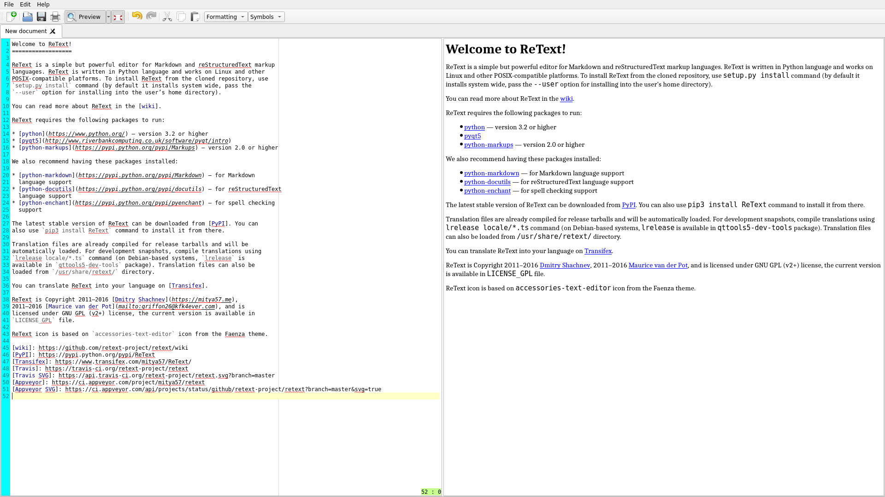

# retext-flatpak

ReText is a simple but powerful text editor for Markdown and reStructuredText.



[Homepage](https://github.com/retext-project/retext)

This repo is about flatpak package.

## Instruction

### Requirements

* [flatpak](https://github.com/flatpak/flatpak)
* [flatpak-builder](https://github.com/flatpak/flatpak-builder)
* [strip-json-comments](https://github.com/sindresorhus/strip-json-comments)

For EL7:

```
# yum install 'flatpak' 'flatpak-builder' 'nodejs-strip-json-comments'
```

You may also want to install the `xdg-desktop-portal*` packages:

```
# yum install 'xdg-desktop-portal*'
```

See also:

* [flatpak setup](https://flatpak.org/setup)

### Adding repository

```
$ flatpak remote-add --if-not-exists flathub https://dl.flathub.org/repo/flathub.flatpakrepo
```

See also:

* [flathub setup](http://docs.flatpak.org/en/latest/using-flatpak.html#add-a-remote)

### Prepare

```
$ flatpak install flathub org.kde.Sdk//5.9
```

```
$ flatpak install flathub io.qt.qtwebkit.BaseApp
```

### Build

```
$ ./flatpak_create.bash
```

### Test

```
$ ./flatpak_shell.bash
```

### Run

```
$ ./flatpak_run.bash
```

## FAQ

### Which JSON file I should use?

* input file: `retext.json.in` (with comments)
* output file: `me.mitya57.ReText.json` (without comments)

Comments are not allowed in JSON files.

### Does flatpak-ed ReText run as superuser?

[No](https://github.com/flatpak/flatpak/issues/1557). It is a [MATE](https://github.com/mate-desktop)/[marco](https://github.com/mate-desktop/marco) [issue](https://github.com/mate-desktop/marco/issues/301).

### Why not use an RPM package?

This is not always possible. For example, for EL7:

* Main repo does not provide the **python3** package. However, there is a **python34** in EPEL7.
* System (main repo + EPEL) does not provide following packages: **python3-enchant**, **python3-docutils**, **python3-textile**, **python3-markups**. However, it is possible to rebuild them for EPEL7.
* System does not provide the **python3-qt5** package.
* **python3-qt5** package depends on **python3-sip** package. The **sip** package is available in EL7, but without **python3** support.
* **python-qt5** requires **sip** >= *4.18*, but EL7 provides only *4.14.6* version. The **sip** package in EL7 has not been updated since the system was released (in 2014).

### Why don't you use new features in Flatpak Manifest (JSON) file?

Because **flatpak-builder** *0.8.x* (latest version available in EL7) doesn't support them. For example:

* `"buildsystem": "simple"` and `build-commands: []`
* `"buildsystem": "cmake-ninja"`

It is possible to install flatpak-builder (CLI tool, IDE for GNOME in another thing) from flathub. However, it requires **flatpak** >= *0.10.0*

```
$ flatpak install flathub org.flatpak.Builder
error: app/org.flatpak.Builder/x86_64/stable needs a later flatpak version (0.10.0)
```

The **flatpak** (and **flatpak-builder**) >= *0.10.4* will be available in [EL 7.6](https://bugzilla.redhat.com/show_bug.cgi?id=1570030), probably in Q1-Q2 [2019](https://en.wikipedia.org/wiki/Red_Hat_Enterprise_Linux#RHEL_7).

It is possible to install **flatpak** (and **flatpak-builder**) >= *0.10.x* from a [COPR](https://copr.fedorainfracloud.org/) repo, but it will replace packages from main repo.

* [scx/flatpak](https://copr.fedorainfracloud.org/coprs/scx/flatpak/)
* [amigadave/flatpak-epel7](https://copr.fedorainfracloud.org/coprs/scx/flatpak/)

### Are you the author of ReText?

No, I only created flatpak package for it.

See also:

* [ReText readme](https://github.com/retext-project/retext/blob/master/README.md)

