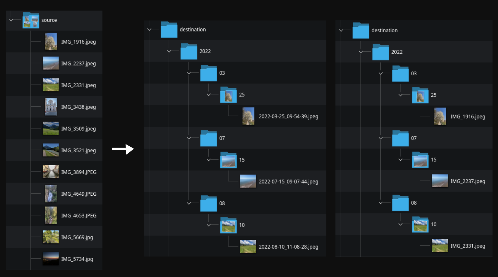

# Photo Organizer
A simple cross-platform desktop application to organize your photos into folders based on their EXIF date.

---
## Features
- **EXIF-based organization** — reads the original capture date from image metadata
- **Flexible folder structure** — choose between `yyyy`, `yyyy/mm`, or `yyyy/mm/dd`
- **Recursive scanning** — automatically scans all subdirectories of the source folder
- **Optional renaming** — rename files using their Date & Time (e.g. `2024-03-15_14-30-22.jpeg`)
- **Live preview** — inspect image dimensions, DPI, color model and depth before organizing
---
## Screenshots


---
## Installation from source
### Requirements
- Python 3.10 or newer
- PySide6 >= 6.6.0
- Pillow >= 10.0.0
#### Steps
```bash
# 1. Clone the repository
git clone https://github.com/giuseppecigala/PhotoOrganizer.git
cd PhotoOrganizer

# 2. Create a virtual environment
python3 -m venv .venv

# 3. Activate it
source .venv/bin/activate      

# 4. Install dependencies
pip install -r requirements.txt

# 5. Run the application
python3 main.py
```
---
## Usage
1. Click **Select Source** and choose the folder containing your photos.
   All subfolders are scanned automatically.
2. Click **Select Destination** and choose where the organized photos will be copied.
3. Pick a folder structure from the **Structure** dropdown
   (`yyyy`, `yyyy/mm`, or `yyyy/mm/dd`).
4. Optionally enable **Rename by Date** to replace original filenames
   (e.g. `IMG1234.jpeg`) with the EXIF Date & Time (e.g. `2024-03-15_14-30-22.jpeg`).
5. Click **Organize Photos** to start the operation.

**The original files are never modified or deleted** — Photo Organizer only copies them to the destination.

### Example
Given a source folder containing:
```
IMG_0001.jpeg   (taken 2023-07-12 09:15:33)
IMG_0002.jpeg   (taken 2024-03-15 14:30:22)
IMG_0003.jpeg   (taken 2024-03-15 18:05:10)
```
With structure `yyyy/mm/dd` and **Rename by Date** enabled, the destination will look like:
```
2023/07/12/2023-07-12_09-15-33.jpeg
2024/03/15/2024-03-15_14-30-22.jpeg
2024/03/15/2024-03-15_18-05-10.jpeg
```
---
## License
Photo Organizer is free software released under the
**GNU Lesser General Public License v3.0 or later**.

This application uses [PySide6](https://www.qt.io/qt-for-python),
which is licensed under the LGPL v3.