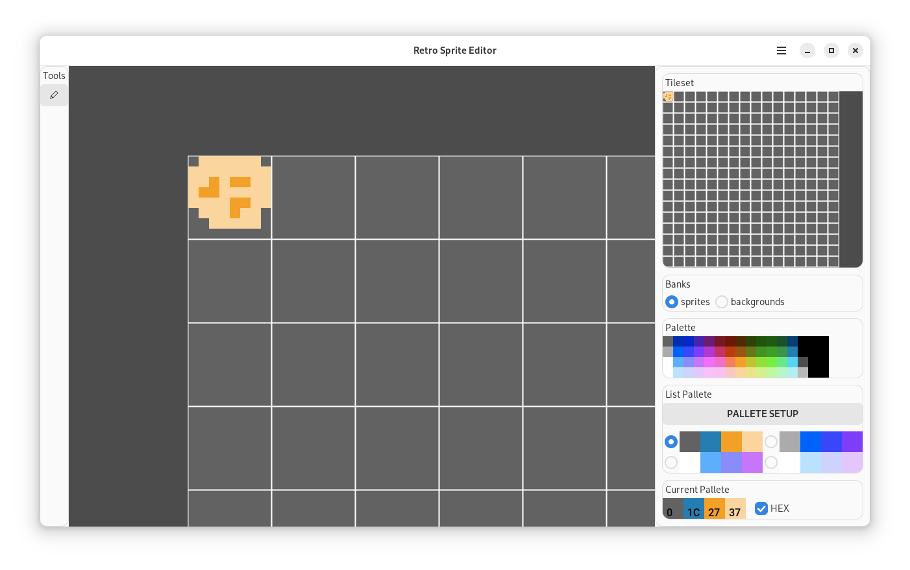

# RetroSpriteEditor

Draw your sprites and backgrounds with this program specially designed for retro consoles. There is only a pencil available.

## FEATURES
* saving to NES format
* pencil for pixel art
* completely free software

## NES
* 4 palettes to choose from, which can be customized.
* two memory banks for sprites and backgrounds.
* showing the color index numbers.
