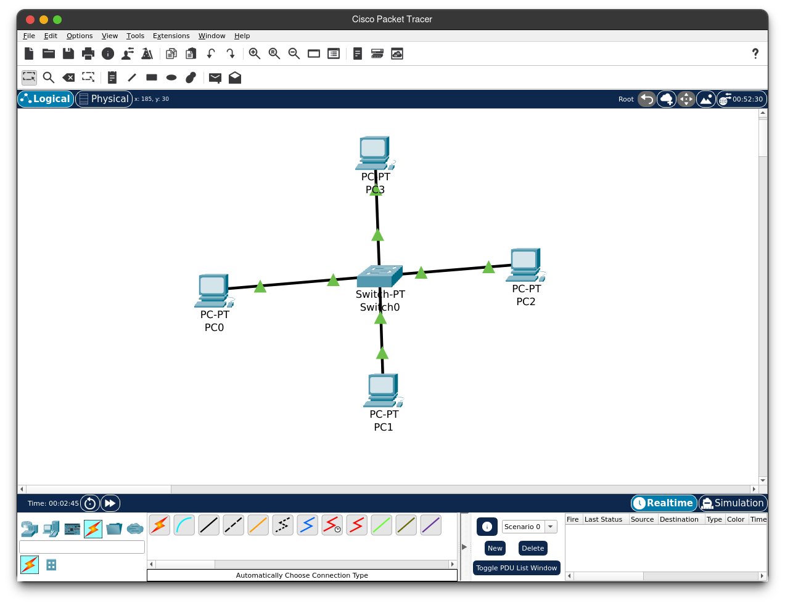

# Zen App Manager

<p align="center">
  
</p>

<p align="center">
  <b>The easiest way to manage your startup apps on Linux & Windows.</b>
</p>

<p align="center">
  <a href="#features">Features</a> •
  <a href="#installation">Installation</a> •
  <a href="#screenshots">Screenshots</a> •
  <a href="#license">License</a>
</p>

---

**Zen App Manager** is designed for everyone. Whether you are a Linux beginner or a power user, managing which applications start when you turn on your computer shouldn't be complicated. 

Say goodbye to complex terminal commands or hidden configuration files. With Zen App Manager, you get a beautiful, modern interface to take control of your startup routine.

## Features

*   **✨ Beginner Friendly:** Simple, intuitive interface. No coding or terminal knowledge required.
*   **🚀 Boost Boot Time:** Easily disable unwanted apps that slow down your startup.
*   **📂 Smart Detection:** Automatically detects apps from Startup Folder and **Windows Registry**.
*   **📊 Detailed Info:** See file sizes, locations, and publisher information at a glance.
*   **➕ Add Anything:** Add your favorite apps or custom commands to startup with just a few clicks.
*   **🎨 Beautiful Design:** A sleek, modern dark-themed UI that looks great on any desktop.
*   **⚡ Lightweight:** Built with Rust, so it uses almost no system resources.
*   **🔒 Safe & Secure:** Available as a sandboxed Flatpak for maximum security.

## Screenshots


*(A clean and simple interface to manage your apps)*

## Installation

### 🐧 Linux (Recommended)

The easiest way to install on Linux is via **Flathub**. It works on almost any Linux distribution (Ubuntu, Fedora, Arch, Mint, etc.).

```bash
flatpak install flathub com.zen.zen-app-manager
```

### 🪟 Windows

We support Windows too! You don't need to install anything complex.

1.  Go to the **[Releases Page](https://github.com/d0ksan8/zen-app-manager/releases/latest)**.
2.  Download the latest `.exe` file (e.g., `Zen-App-Manager_x.x.x_x64-setup.exe`).
3.  Double click to install. That's it!

---

### 🛠️ Building from Source (Advanced)

If you are a developer or want to build it yourself:

**Prerequisites:**
- **Node.js** (v18+)
- **Rust** (via [rustup.rs](https://rustup.rs))
- **Linux:** `webkit2gtk-4.1`, `libgtk-3-dev`
- **Windows:** Visual Studio Build Tools

**Build Steps:**

1.  Clone the repository:
    ```bash
    git clone https://github.com/d0ksan8/zen-app-manager.git
    cd zen-app-manager
    ```

2.  Install and build:
    ```bash
    npm install
    npm run tauri build
    ```

## Contributing

Contributions are welcome! Feel free to open an issue or submit a pull request.

## License

This project is licensed under the MIT License. See the [LICENSE](LICENSE) file for details.
## Acknowledgements

Special thanks to [@serhatstal](https://github.com/serhatstal) for their valuable feedback and support! 🚀
