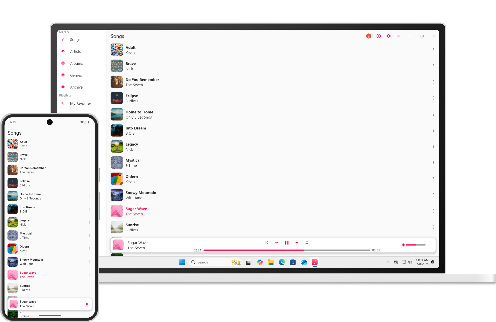

# Flathub: Crossfire rpg

A flatpak package providing Java client for [Crossfire RPG](https://crossfire.real-time.com/).

## Description

This provides Crossfire java client flatpak packaging for flathub.

### Game description

Crossfire is an open source, cooperative multiplayer graphical RPG and adventure game. 
Since its initial release, Crossfire has grown to encompass over 150 monsters, about 
3000 maps to explore, an elaborate magic system, 13 races, 15 character classes, 
a system of skills, and many artifacts and treasures. Crossfire is based in a 
medieval fantasy world and is similar to other games of this genre.

### Screenshots

### Game Links

- [Website](https://crossfire.real-time.com/)
- [Bugtracker](https://sourceforge.net/p/crossfire/bugs/)

## LICENSE

The package metadata is licensed under a
[CC-BY-SA-3.0](https://creativecommons.org/licenses/by-sa/3.0/) license.

The packaged program is licensed under a
[GPL-2.0](https://spdx.org/licenses/GPL-2.0.html) license.
