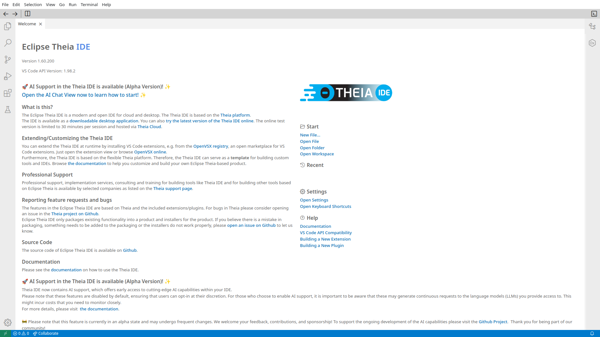

# CliA - AI Terminal Agent

**CLI + AI = CliA**  
A powerful terminal application with integrated AI assistance.

## Introduction

CliA is a GTK4-based terminal emulator that brings AI directly into your command-line workflow. 
Work in the terminal while having an AI agent by your side, ready to help with commands, troubleshooting, coding, and more.

## Key Features

- **Full-featured terminal emulator** - All the terminal functionality you need
- **Integrated AI chat** - Get instant help without leaving your terminal window
- **Seamless workflow** - Switch effortlessly between terminal commands and AI conversations
- **Ask while you work** - Get explanations, command suggestions, and solutions in real-time
- **Modern GTK4 interface** - Clean and intuitive user experience

## Screenshots

## Why CliA?

Stop switching between your terminal and browser to search for command syntax or error solutions. 
With CliA, your AI agent is always there, in the same window, ready to help you solve problems faster.
