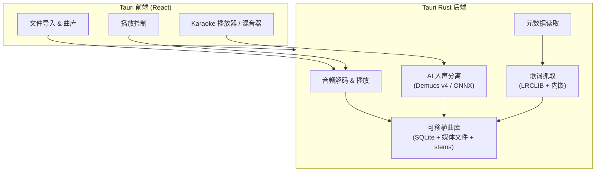

[English](./README.md)

<div align="center">


# OpenKara

**把你的音乐库变成 Karaoke 舞台。**

基于端侧 AI 人声分离和同步歌词的开源桌面 Karaoke 应用。

[](https://github.com/thedavidweng/OpenKara/actions/workflows/ci.yml)
[](./LICENSE)


</div>

---

## 演示

<div align="center">

[](https://youtu.be/OznVDmp9igk)

</div>

---

## 为什么做这个

我很喜欢在家唱卡拉 OK，但是市面上现有的解决方案都各有各的问题。

最成熟的选项可能是 [Karafun](https://www.karafun.com/)，他们是一个付费服务，通过重新录制著名歌曲的方式来规避版权。这很好，但是存在以下问题：

1. 他们重新制作的伴奏会跟原版有些许区别
2. 他们的曲库不一定包含我想唱的小众歌曲
3. 我讨厌订阅制服务

除此之外，还有 [Apple Music Sing](https://www.apple.com/ca/newsroom/2022/12/apple-introduces-apple-music-sing/)。他们提供了在设备上运行去人声模型支持的卡拉 OK 功能。这很好，但 Apple Music 同样也是一个订阅服务，而我讨厌订阅制。

为了避免订阅制，你也可以选择去拥抱更传统的解决方案，比如用 [OpenKJ](https://github.com/OpenKJ/OpenKJ) 这样的项目来播放 CD+G/media+g 文件，但是 CD+G 很小众，难找到而且需要被单独购买。

最后剩下的几乎也就只剩在 YouTube 上寻找那些来路不明、版权模糊的卡拉 OK 视频了。这不仅不是一个统一良好的体验，也时常缺失我想唱的歌曲。

于是我自己的不妥协解决方案诞生了：OpenKara 使用开源技术来分离你已经拥有的以未加密形式存在的数字音乐（可能来自你的 CD 翻录、[Bandcamp](https://bandcamp.com/)、[Qobuz](https://www.qobuz.com/)、iTunes 或者你的本地图书馆提供的音乐服务）。我知道还有很多人喜欢一次性购买并拥有的感觉，因为我就是这样的人。OpenKara 可以将我已有的音乐库转换成卡拉 OK 曲库，这样我就不用去 KTV 花钱，而且曲库取决于我个人的喜好而不是大众的喜好。

## 功能亮点

- **本地音频导入** — 直接使用你已有的音乐，无需订阅，无需重复购买。
- **AI 人声分离** — 在本地完成歌曲的人声与伴奏分离。
- **同步歌词** — 可从在线来源、内嵌标签或 `.lrc` 伴随文件加载时间同步歌词。
- **CD+G 伴随图形** — 如果歌曲旁边有同名 `.cdg` 文件，OpenKara 会在全屏播放时渲染对应图形。
- **可移植曲库** — 自包含的曲库目录，可放置在 NAS、USB 硬盘上，跨设备共享。
- **跨平台** — 支持 macOS、Windows 和 Linux。
- **四轨混音器** — 人声、鼓、贝斯、其他乐器独立音量控制。可折叠的伴奏滑块，展开查看各轨详情。
- **双分离模式** — 可选择双轨（人声 + 伴奏）或四轨（人声 + 鼓 + 贝斯 + 其他）模式。支持将已分离的双轨曲目按需升级为四轨。
- **高效音轨存储** — 分离后的音轨会以紧凑方式缓存，保持曲库占用可控。
- **断点续传分离** — 逐块检查点机制，中途关闭应用后重启会自动从上次进度继续。

## 快速开始

### 从 Release 安装

从 [GitHub Releases](https://github.com/thedavidweng/OpenKara/releases) 下载对应平台的构建：

| 平台                  | 格式                 |
| --------------------- | -------------------- |
| macOS (Apple Silicon) | `.dmg`               |
| macOS (Intel)         | `.dmg`               |
| Windows               | `.exe` (NSIS 安装包) |
| Linux                 | `.AppImage` / `.deb` |

**macOS (Homebrew)：**

```bash
brew install thedavidweng/tap/openkara
```

**macOS Gatekeeper 提示：** 如果 macOS 提示应用已损坏或无法打开，请在终端运行：

```bash
xattr -rd com.apple.quarantine /Applications/OpenKara.app
```

首次启动时，OpenKara 会引导你创建 Karaoke 曲库，并在后台开始下载默认 AI 模型。

### 从源码构建

**前置条件：**

- [Node.js](https://nodejs.org/) 20+
- [pnpm](https://pnpm.io/) 10+
- [Rust](https://rustup.rs/) stable 工具链
- [Tauri 2](https://v2.tauri.app/start/prerequisites/) 平台依赖

```bash
git clone https://github.com/thedavidweng/OpenKara.git
cd OpenKara
pnpm install
./scripts/setup.sh      # 下载 Demucs ONNX 模型用于本地开发
pnpm tauri dev
```

### 应用图标

- 源图标：`src-tauri/icons/app-icon.png`（`1024x1024` 主母版）
- 重新生成全平台图标：`pnpm icons:generate`
- 生成产物会写入 `src-tauri/icons/`，用于 Tauri 桌面端以及未来可能的移动端目标

## AI 模型

OpenKara 使用自定义 ONNX 格式的 [Demucs](https://github.com/adefossez/demucs) 模型进行音轨分离。模型由独立仓库维护：

**[openkara-models](https://github.com/thedavidweng/openkara-models)** — 可复现的 ONNX 模型转换流水线

| 模型          | 说明                             | 输入                          | 输出                           | 格式             |
| ------------- | -------------------------------- | ----------------------------- | ------------------------------ | ---------------- |
| `htdemucs`    | 标准 — Hybrid Transformer Demucs | 44.1 kHz 立体声音频（7.8 秒） | 4 条音轨：鼓、贝斯、其他、人声 | ONNX（opset 17） |
| `htdemucs_ft` | 高质量 — 微调 4 模型集成         | 44.1 kHz 立体声音频（7.8 秒） | 4 条音轨：鼓、贝斯、其他、人声 | ONNX（opset 17） |

首次启动时，OpenKara 会将标准 `openkara-models` v2.0.1 资源下载到应用数据目录。当前标准模型磁盘大小约为 339 MiB，可选的高质量模型约为 1.32 GiB。两者都已完成 ONNX Runtime 离线优化，并携带用于缓存失效的 metadata。详见 [openkara-models README](https://github.com/thedavidweng/openkara-models#readme) 了解转换流水线。开发环境和需要稳定输入的测试可运行 `./scripts/setup.sh` 填充 `src-tauri/models/`。

## 技术栈

| 层级     | 技术                                                                                                    | 用途                         |
| -------- | ------------------------------------------------------------------------------------------------------- | ---------------------------- |
| 桌面框架 | [Tauri 2](https://github.com/tauri-apps/tauri)                                                          | Rust 后端 + 系统 WebView     |
| 前端     | [React](https://github.com/facebook/react) 19 + [TypeScript](https://github.com/microsoft/TypeScript) 5 | UI 组件                      |
| 构建工具 | [Vite](https://github.com/vitejs/vite) 7                                                                | 开发服务器与生产构建         |
| 样式     | [Tailwind CSS](https://github.com/tailwindlabs/tailwindcss) 4                                           | 原子化 CSS                   |
| 状态管理 | [Zustand](https://github.com/pmndrs/zustand)                                                            | 轻量全局状态                 |
| 音频解码 | [symphonia](https://github.com/pdeljanov/Symphonia)                                                     | 纯 Rust 解码器               |
| 音频输出 | [cpal](https://github.com/RustAudio/cpal)                                                               | 跨平台音频播放               |
| AI 推理  | [ONNX Runtime](https://github.com/microsoft/onnxruntime) via [ort](https://github.com/pykeio/ort)       | Demucs v4 音轨分离           |
| 歌词     | [LRCLIB](https://lrclib.net/)                                                                           | 开放同步歌词 API             |
| 元数据   | [lofty](https://github.com/Serial-ATA/lofty-rs)                                                         | ID3v2、Vorbis、FLAC 标签读取 |
| 音频编码 | [vorbis_rs](https://github.com/ComunidadAylas/vorbis-rs)                                                | OGG/Vorbis 音轨压缩          |
| 数据库   | [SQLite](https://github.com/sqlite/sqlite) via [rusqlite](https://github.com/rusqlite/rusqlite)         | 歌曲、歌词与 stems 缓存      |

## 系统架构



## 支持的格式

| 格式         | 导入 | 人声分离 |
| ------------ | ---- | -------- |
| MP3          | ✅   | ✅       |
| FLAC         | ✅   | ✅       |
| WAV          | ✅   | ✅       |
| OGG / Vorbis | ✅   | ✅       |
| AAC / M4A    | ✅   | ✅       |

所有音频在送入 Demucs 模型前会重采样为 44.1 kHz 立体声。

## 可移植曲库

OpenKara 将所有数据存储在一个自包含的曲库目录中：

```
MyKaraokeLibrary/
├── .openkara-library       # 标记文件
├── openkara.db             # SQLite 数据库
├── media/                  # 导入的音频副本
│   └── {hash}.mp3
└── stems/                  # 分离后的音轨
    └── {hash}/
        ├── vocals.ogg
        ├── accompaniment.ogg   # 双轨模式
        ├── drums.ogg           # 四轨模式
        ├── bass.ogg            # 四轨模式
        └── other.ogg           # 四轨模式
```

数据库中的所有路径均为相对路径 — 曲库可以移动到 NAS、USB 硬盘或网络共享目录，任何操作系统上的 OpenKara 实例都可以直接打开使用。每台设备的配置（曲库位置）单独存储在应用数据目录中。

## 路线图

### ✅ v0.1 — MVP

- [x] 项目脚手架（Tauri 2 + React + TypeScript + Vite）
- [x] SQLite 数据库与迁移系统
- [x] 音频导入与元数据提取（ID3v2、Vorbis、FLAC）
- [x] 曲库搜索与浏览
- [x] 音频解码与播放（symphonia + cpal）
- [x] 播放状态机（播放 / 暂停 / 跳转 / 音量）
- [x] Demucs v4 ONNX 人声分离（含进度追踪）
- [x] Stems 缓存（基于 hash，重放无需重新推理）
- [x] Karaoke 模式切换（原声 / 伴奏）
- [x] 同步歌词抓取（LRCLIB → 内嵌标签 → sidecar .lrc）
- [x] 歌词展示（rAF 同步、点击跳转）
- [x] 逐曲歌词时间偏移调整
- [x] 首次启动 AI 模型自动下载
- [x] 可移植曲库系统（相对路径）
- [x] 完整前端 UI（侧边栏、播放器、歌词面板、设置）
- [x] 键盘快捷键（空格、方向键）
- [x] 拖放导入
- [x] CI/CD 流水线（macOS、Windows、Linux）
- [x] 发布自动化（tag → GitHub Release）

### v0.2.0 — 已发布

OpenKara v0.2.0 是确立当前核心应用流程的版本。

- [x] 四轨音量混音器（可折叠 UI）
- [x] 双分离模式（双轨 / 四轨）及设置持久化
- [x] 高效压缩音轨存储
- [x] 断点续传分离（逐块检查点）
- [x] 多线程 ONNX 推理优化
- [x] 设置系统（音轨模式配置）
- [x] UI 打磨与过渡动画
- [x] 错误提示与用户级错误信息
- [x] 应用图标与品牌设计

### v0.4.0 — 已发布

OpenKara v0.4.0 现在是当前稳定版本。本次更新包含：

- 支持 AirPlay 投放播放内容到兼容设备
- 改进了窄窗口宽度下的播放器行为与布局
- 优化了 Windows 应用外观细节
- 导入时更好地保留原始音轨元数据
- 支持在 Windows 上通过 WinGet 安装

### 📋 未来计划

- **麦克风输入与人声效果** — 麦克风采集、混响、回声、音量混合
- **播放列表与排队** — 多歌曲队列、多人轮流演唱
- **音高与调性调整** — 实时调整伴奏音高
- **演唱录制** — 录制人声表演，导出为音频文件
- **多屏支持** — 第二屏幕显示观众歌词视图
- **CJK 注音** — 在原文歌词旁显示罗马字 / 拼音

## 开发指南

### 前置条件

- Node.js 20+
- pnpm 10+
- 通过 [rustup](https://rustup.rs/) 安装的 Rust stable
- 对应平台的 [Tauri 2 依赖](https://v2.tauri.app/start/prerequisites/)

### 环境搭建

```bash
pnpm install
./scripts/setup.sh          # 下载 Demucs ONNX 模型到 src-tauri/models/
pnpm tauri dev               # 启动开发服务器（支持热更新）
```

`scripts/setup.sh` 只会把模型放置到 `src-tauri/models/` 目录，供本地开发和确定性测试使用。终端用户安装后的运行时模型默认下载到应用数据目录。

### 运行测试

```bash
cd src-tauri && cargo test   # 后端测试（70+ 测试用例）
pnpm lint                    # ESLint 检查
pnpm format                  # Prettier 格式检查
```

### 构建

```bash
pnpm tauri build             # 生产构建，生成平台特定安装包
```

### CI/CD

- 推送到 `main` 会触发 CI 流程（[`.github/workflows/ci.yml`](./.github/workflows/ci.yml)）— 在 macOS、Windows、Linux 上运行 lint、构建和测试。
- 推送版本标签（如 `v0.4.0`）会触发发布流程（[`.github/workflows/release.yml`](./.github/workflows/release.yml)）— 构建并上传二进制文件到 GitHub Release。

## 文档

- [文档总览](./docs/README.md) — 设计文档、执行计划、产品规范、参考资料与站点内容总入口
- [系统架构](./docs/design-docs/architecture.md) — 系统设计、技术栈、数据流与运行时细节
- [项目结构](./docs/design-docs/project-structure.md) — 当前目录布局与模块职责
- [开发阶段](./docs/design-docs/development-phases.md) — 阶段清单与验证步骤
- [技术路线图](./docs/design-docs/roadmap.md) — 技术选型、API 契约与风险应对
- [里程碑](./docs/design-docs/milestones.md) — 里程碑任务表与交付标准

## 参与贡献

欢迎贡献！涉及较大改动时，请先提交 Issue 讨论方案。

1. Fork 本仓库
2. 创建功能分支（`git checkout -b feature/my-feature`）
3. 确保测试通过（`cargo test`）
4. 提交 Pull Request

## 致谢

- [Demucs](https://github.com/adefossez/demucs) — Meta Research 的 AI 音轨分离模型
- [openkara-models](https://github.com/thedavidweng/openkara-models) — OpenKara 的 ONNX 模型转换流水线
- [demucs.onnx](https://github.com/sevagh/demucs.onnx) — STFT/ISTFT 实值 ONNX 转换参考
- [LRCLIB](https://lrclib.net) — 开放的同步歌词 API
- [monochrome](https://github.com/monochrome-music/monochrome) — 歌词同步与 LRCLIB 集成方案参考

## 许可证

[MIT](./LICENSE) — Copyright (c) 2025 David Weng
